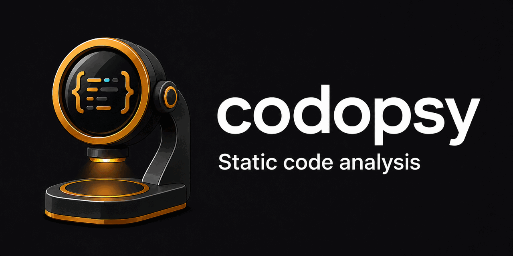

<p align="center">
  
</p>

AST-level code quality analyzer for 35 languages with 182 lint rules. Uses [tree-sitter](https://tree-sitter.github.io/) to parse source code into ASTs and analyzes complexity, lint issues, and structural quality — without executing code.

## Supported Languages

| Language | Extensions | Lint Rules | Complexity |
|----------|-----------|------------|------------|
| TypeScript/TSX | `.ts` `.tsx` | 23 rules | CC + Cognitive |
| JavaScript | `.js` `.jsx` `.mjs` `.cjs` | 23 rules | CC + Cognitive |
| Python | `.py` `.pyi` | 17 rules | CC + Cognitive |
| Rust | `.rs` | 14 rules | CC + Cognitive |
| Go | `.go` | 14 rules | CC + Cognitive |
| Java | `.java` | 12 rules | CC + Cognitive |
| C/C++ | `.c` `.h` `.cpp` `.cc` `.cxx` `.hpp` `.hxx` | 9 rules | CC + Cognitive |
| Lean 4 | `.lean` | 8 rules | CC + Cognitive |
| Bash | `.sh` `.bash` `.zsh` | 7 rules | CC + Cognitive |
| Kotlin | `.kt` `.kts` | 6 rules | CC + Cognitive |
| Swift | `.swift` | 6 rules | CC + Cognitive |
| Ruby | `.rb` | 5 rules | CC + Cognitive |
| PHP | `.php` | 5 rules | CC + Cognitive |
| Haskell | `.hs` | 5 rules | CC + Cognitive |
| Scala | `.scala` `.sc` | 5 rules | CC + Cognitive |
| Dart | `.dart` | 5 rules | CC + Cognitive |
| Crystal | `.cr` | 5 rules | CC + Cognitive |
| Clojure | `.clj` `.cljs` `.cljc` `.edn` | 4 rules | CC + Cognitive |
| Elixir | `.ex` `.exs` | 4 rules | CC + Cognitive |
| Lua | `.lua` | 4 rules | CC + Cognitive |
| Zig | `.zig` | 4 rules | CC + Cognitive |
| Groovy | `.groovy` `.gvy` | 4 rules | CC + Cognitive |
| Julia | `.jl` | 4 rules | CC + Cognitive |
| Gleam | `.gleam` | 3 rules | CC + Cognitive |
| Erlang | `.erl` `.hrl` | 3 rules | CC + Cognitive |
| Elm | `.elm` | 3 rules | CC + Cognitive |
| C# | `.cs` | universal | CC + Cognitive |
| OCaml | `.ml` `.mli` | universal | CC + Cognitive |
| Almide | `.almd` | universal | CC + Cognitive |
| HTML | `.html` `.htm` | threshold | structure |
| CSS | `.css` | threshold | structure |
| JSON | `.json` | threshold | structure |
| YAML | `.yml` `.yaml` | threshold | structure |

**universal** = todo-comment + no-empty-function + syntax-error + threshold rules.

## Install

Homebrew (macOS and Linux):

```bash
brew install o6lvl4/tap/codopsy
```

Prebuilt binary — no toolchain required:

```bash
# macOS (Apple Silicon)
curl -sSfL https://github.com/O6lvl4/codopsy/releases/latest/download/codopsy-aarch64-apple-darwin.tar.gz | tar xz
# macOS (Intel)
curl -sSfL https://github.com/O6lvl4/codopsy/releases/latest/download/codopsy-x86_64-apple-darwin.tar.gz | tar xz
# Linux (x86_64)
curl -sSfL https://github.com/O6lvl4/codopsy/releases/latest/download/codopsy-x86_64-unknown-linux-gnu.tar.gz | tar xz

sudo mv codopsy /usr/local/bin/
```

From source (Rust 1.80+; builds 35 tree-sitter grammars, so expect a few minutes):

```bash
cargo install --git https://github.com/O6lvl4/codopsy.git
```

## Usage

```bash
# Analyze a project
codopsy analyze ./src

# Verbose output (per-file details)
codopsy analyze ./src -v

# Output to stdout as JSON
codopsy analyze ./src -o -

# Only analyze changed files (vs main branch)
codopsy analyze ./src --diff main

# Show complexity hotspots (requires git)
codopsy analyze ./src --hotspots

# Save baseline for regression tracking
codopsy analyze ./src --save-baseline

# Fail CI if quality degrades
codopsy analyze ./src --no-degradation --fail-on-warning

# Initialize config
codopsy init
```

## Quality Score

Each file is scored 0–100 from three components, summed and rounded:

| Component | Weight | What it measures |
|-----------|--------|-----------------|
| Complexity | 35 | Per-function penalty for exceeding the cyclomatic/cognitive complexity thresholds |
| Issues | 40 | Lint violations, grouped by rule, weighted by severity |
| Structure | 25 | `max-lines` / `max-depth` / `max-params` violations |

The project score is a `sqrt(function_count + 1)`-weighted average of file
scores (files with more functions carry more weight), minus a small penalty
for the total number of issues scattered across the project.

**The Complexity component uses the *same* `max-complexity` /
`max-cognitive-complexity` thresholds — whether from `.codopsyrc.json` or the
`--max-complexity`/`--max-cognitive-complexity` flags — that decide whether a
warning is emitted for a function.** There is no separate, hidden threshold:
if you configure `max-complexity: 20`, a function at complexity 15 costs
nothing in either the issue list or the score. Each function's excess over
the threshold is penalized per unit (capped per function, so one outlier
can't dominate a file's score), and a file's Complexity component floors at 0
once the sum of its functions' excess crosses the 35-point budget — further
increases in complexity beyond that point don't cost additional points, but
they also don't recover any until the file's total excess drops back under
the budget. Disabling a rule (`"max-complexity": false`) removes it from the
score entirely, not just from the issue list.

Run with `-v`/`--verbose` to see the score breakdown per file, and the
`scoringThresholds` field in JSON output records exactly what was used for a
given run.

| Grade | Score |
|-------|-------|
| A | 90–100 |
| B | 75–89 |
| C | 60–74 |
| D | 40–59 |
| F | 0–39 |

## Configuration

Create `.codopsyrc.json` in your project root (or run `codopsy init`):

```json
{
  "rules": {
    "no-console": "warning",
    "no-debugger": "error",
    "no-eval": "error",
    "max-lines": { "severity": "warning", "max": 300 },
    "max-depth": { "severity": "warning", "max": 4 },
    "max-params": { "severity": "warning", "max": 4 },
    "max-complexity": { "severity": "warning", "max": 10 },
    "max-cognitive-complexity": { "severity": "warning", "max": 15 },
    "no-println": false
  },
  "skipDirs": ["/custom-build/"],
  "skipFiles": ["generated.ts"]
}
```

Rules can be set to `"warning"`, `"error"`, `"info"`, or `false` (disabled). Threshold rules accept `{ "severity": ..., "max": N }`.

Config is searched upward from the target directory to the home directory.

## Rules

### JS/TS Rules (23)

| Rule | Default | Description |
|------|---------|-------------|
| `no-any` | warning | Disallow `any` type |
| `no-console` | warning | Disallow `console.*` calls |
| `no-var` | warning | Disallow `var` declarations |
| `eqeqeq` | warning | Require `===`/`!==` over `==`/`!=` |
| `no-empty-function` | warning | Disallow empty function bodies |
| `no-nested-ternary` | warning | Disallow nested ternary expressions |
| `no-debugger` | error | Disallow `debugger` statements |
| `no-duplicate-case` | error | Disallow duplicate switch cases |
| `no-self-assign` | warning | Disallow self-assignment |
| `no-eval` | error | Disallow `eval()` |
| `no-unreachable` | error | Detect unreachable code after return/throw |
| `no-constant-condition` | warning | Disallow constant conditions (`if (true)`) |
| `default-case` | warning | Require default case in switch |
| `no-fallthrough` | warning | Disallow case fallthrough without break |
| `no-self-compare` | warning | Disallow `x === x` self-comparison |
| `no-useless-catch` | error | Disallow catch that only re-throws |
| `use-isnan` | error | Require `Number.isNaN()` instead of `=== NaN` |
| `no-compare-neg-zero` | error | Disallow comparison with `-0` |
| `no-unsafe-negation` | error | Disallow `!key in obj` (wrong precedence) |
| `no-constructor-return` | error | Disallow return with value in constructor |
| `valid-typeof` | error | Require valid typeof comparison strings |
| `no-useless-rename` | warning | Disallow `import { x as x }` |
| `no-empty-pattern` | warning | Disallow empty destructuring `const {} = x` |

### Rust Rules (14)

| Rule | Default | Description |
|------|---------|-------------|
| `no-unsafe` | warning | Disallow `unsafe` blocks |
| `no-unwrap` | warning | Disallow `.unwrap()` |
| `no-dbg` | warning | Disallow `dbg!()` macro |
| `no-todo` | warning | Disallow `todo!()`/`unimplemented!()` |
| `no-println` | info | Disallow `println!()`/`print!()` etc. |
| `no-empty-function` | warning | Disallow empty function bodies |
| `needless-bool` | warning | Simplify `if c { true } else { false }` |
| `needless-return` | warning | Remove explicit `return` in tail position |
| `bool-comparison` | warning | Simplify `x == true` to `x` |
| `collapsible-if` | warning | Merge `if a { if b { } }` to `if a && b { }` |
| `single-match` | warning | Prefer `if let` over single-arm match |
| `manual-map` | warning | Prefer `.map()` over match Some/None |
| `redundant-clone` | warning | Detect `.clone().clone()` |
| `eq-op` | warning | Detect self-comparison `x == x` |

### Go Rules (10)

| Rule | Default | Description |
|------|---------|-------------|
| `no-panic` | warning | Avoid bare `panic()` |
| `no-fmt-print` | info | Avoid `fmt.Println()`, use structured logger |
| `no-ignored-error` | warning | Detect `_ = err` ignored errors |
| `no-os-exit` | warning | Avoid `os.Exit()` |
| `no-defer-in-loop` | warning | Avoid `defer` inside loops |
| `no-empty-block` | warning | Detect empty if/for blocks |
| `no-unreachable` | warning | Detect code after return/break |
| `no-naked-return` | warning | Avoid bare return with named returns |
| `no-range-over-string` | info | Flag range over string variable |
| `no-shadow-import` | warning | Detect variable shadowing import |

### Python Rules (13)

| Rule | Default | Description |
|------|---------|-------------|
| `no-bare-except` | warning | Avoid bare `except:` |
| `no-print` | info | Avoid `print()`, use logging |
| `no-eval` | error | Disallow `eval()`/`exec()` |
| `no-mutable-default` | warning | Disallow mutable default arguments |
| `no-global` | warning | Avoid `global` keyword |
| `no-assert` | info | Avoid `assert` in non-test code |
| `unreachable` | warning | Detect code after return/raise |
| `pointless-except` | warning | Detect except that only re-raises |
| `no-pass-body` | info | Detect function/class with only `pass` |
| `no-star-import` | warning | Avoid `from x import *` |
| `no-nested-with` | warning | Combine nested `with` statements |
| `no-return-in-init` | error | Disallow return value in `__init__` |
| `simplify-boolean-return` | warning | Simplify `if c: return True else: return False` |

### Java Rules (12)

| Rule | Default | Description |
|------|---------|-------------|
| `no-sysout` | warning | Avoid `System.out.println()` |
| `no-print-stack-trace` | warning | Avoid `e.printStackTrace()` |
| `no-empty-catch` | warning | Disallow empty catch blocks |
| `no-throws-exception` | warning | Avoid `throws Exception` (too broad) |
| `no-raw-type` | warning | Require generics on collection types |
| `no-string-equality` | warning | Use `.equals()` instead of `==` for strings |
| `missing-switch-default` | warning | Require default in switch |
| `no-empty-if` | warning | Detect empty if blocks |
| `no-double-brace-init` | warning | Avoid `new X() {{ }}` initialization |
| `no-string-concat-in-loop` | warning | Use StringBuilder in loops |
| `no-nested-try` | warning | Avoid nested try blocks |
| `equals-null` | error | Detect `x.equals(null)` |

### C/C++ Rules (9)

| Rule | Default | Description |
|------|---------|-------------|
| `no-printf` | info | Avoid `printf()`/`sprintf()` in production |
| `no-unsafe-fn` | error | Disallow `gets()`/`strcpy()`/`strcat()` |
| `no-malloc` | info | Flag `malloc()`/`calloc()` usage |
| `no-goto` | warning | Avoid `goto` statements |
| `no-sizeof-ptr` | warning | Detect `sizeof(ptr)` on pointers |
| `no-magic-number` | info | Flag numeric literals (not 0/1) |
| `no-implicit-fallthrough` | warning | Require break in switch cases |
| `no-empty-if` | warning | Detect empty if blocks |
| `no-void-main` | warning | Use `int main()` not `void main()` |

### Lean 4 Rules (8)

| Rule | Default | Description |
|------|---------|-------------|
| `no-sorry` | error | `sorry` leaves a declaration unproved |
| `no-axiom` | warning | `axiom` adds an unproved assumption |
| `no-native-decide` | warning | `native_decide` trusts the compiler, not just the kernel |
| `no-unsafe` | warning | `unsafe` bypasses soundness guarantees |
| `no-unlimited-heartbeats` | warning | `set_option maxHeartbeats 0` removes the elaboration timeout |
| `no-partial-def` | info | `partial` skips the termination checker |
| `no-dbg-trace` | info | `dbg_trace` is leftover debug output |
| `no-debug-command` | info | `#eval` / `#check` / `#print` / `#reduce` left in the file |

Lean is macro-extensible, so no tree-sitter grammar can cover every file. codopsy
parses what it can and reports the rest via the universal `syntax-error` rule
instead of silently scoring an unread file as clean. Hand-written Lean parses
essentially in full; the deepest metaprogramming in `lean4`/`Mathlib` core does not.

### Elixir Rules (4)

| Rule | Default | Description |
|------|---------|-------------|
| `no-io-inspect` | warning | Disallow `IO.inspect()` |
| `no-io-puts` | info | Disallow `IO.puts()` |
| `no-raise-in-with` | warning | Avoid `raise` inside `with` blocks |
| `pipe-into-anonymous` | warning | Avoid piping into anonymous functions |

### Clojure Rules (4)

| Rule | Default | Description |
|------|---------|-------------|
| `no-println` | info | Disallow `println`/`prn`/`print` |
| `no-def-in-def` | warning | Disallow nested `def`/`defn` |
| `no-thread-sleep` | warning | Avoid `Thread/sleep` |
| `no-reflection` | warning | Flag Java reflection calls |

### Erlang Rules (3)

| Rule | Default | Description |
|------|---------|-------------|
| `no-process-flag` | warning | Flag `process_flag` usage |
| `no-catch-all` | warning | Detect catch-all as first clause |
| `no-exit-call` | warning | Avoid `exit()` calls |

### Gleam Rules (3)

| Rule | Default | Description |
|------|---------|-------------|
| `no-todo` | warning | Disallow `todo` expressions |
| `no-panic` | warning | Disallow `panic` expressions |
| `no-let-assert` | warning | Avoid `let assert` (crashes at runtime) |

### Kotlin Rules (6)

| Rule | Default | Description |
|------|---------|-------------|
| `no-println` | info | Avoid `println()` |
| `no-unsafe-cast` | warning | Avoid `as` cast; use `as?` |
| `no-not-null-assertion` | warning | Avoid `!!`; use safe calls |
| `no-empty-catch` | warning | Disallow empty catch blocks |
| `no-system-exit` | warning | Avoid `System.exit()` |
| `prefer-val` | info | Prefer `val` over `var` |

### Ruby Rules (5)

| Rule | Default | Description |
|------|---------|-------------|
| `no-puts` | info | Avoid `puts`/`p`/`pp` |
| `no-eval` | error | Disallow `eval` |
| `require-relative` | warning | Use `require_relative` for relative paths |
| `no-rescue-exception` | warning | Avoid `rescue Exception` |
| `no-sleep` | warning | Avoid `sleep` in production |

### PHP Rules (5)

| Rule | Default | Description |
|------|---------|-------------|
| `no-debug-output` | warning | Remove `var_dump`/`dd` |
| `no-eval` | error | Disallow `eval()` |
| `no-exit` | warning | Avoid `die()`/`exit()` |
| `strict-comparison` | warning | Use `===` instead of `==` |
| `no-error-suppression` | warning | Avoid `@` operator |

### Bash Rules (7)

| Rule | Default | Description |
|------|---------|-------------|
| `unquoted-expansion` | warning | Quote `$var` to prevent word splitting |
| `no-eval` | error | Disallow `eval` |
| `cd-without-or` | warning | Use `cd dir \|\| exit 1` |
| `useless-cat` | warning | Use `cmd < file` instead of `cat file \| cmd` |
| `dangerous-rm` | error | Flag `rm -rf` with variable expansion |
| `no-set-e` | info | Add `set -euo pipefail` |
| `test-equals` | warning | Use `=` not `==` in `[ ]` |

### Swift Rules (6)

| Rule | Default | Description |
|------|---------|-------------|
| `no-print` | info | Avoid `print()`; use `os_log` |
| `no-force-unwrap` | warning | Avoid `!` force unwrapping |
| `no-force-try` | warning | Avoid `try!` |
| `no-force-cast` | warning | Avoid `as!` force cast |
| `no-nslog` | warning | Avoid `NSLog` |
| `no-fatal-error` | warning | Avoid `fatalError()` |

### Crystal, Dart, Haskell, Scala, Lua, Zig, Elm, Groovy, Julia

Each has 3–5 dedicated rules targeting debug output, unsafe patterns, and language-specific anti-patterns. See the source in `src/analyzer/rules/` for full details.

### Universal Rules (all languages)

| Rule | Default | Description |
|------|---------|-------------|
| `todo-comment` | info | Detect TODO/FIXME/HACK/XXX comments |
| `no-empty-function` | warning | Detect empty function bodies |
| `syntax-error` | info | Source the parser could not read (results for that file are incomplete) |

### Threshold Rules (all languages)

| Rule | Default | Description |
|------|---------|-------------|
| `max-lines` | 300 | Maximum lines per file |
| `max-depth` | 4 | Maximum nesting depth |
| `max-params` | 4 | Maximum function parameters |
| `max-complexity` | 10 | Maximum cyclomatic complexity per function |
| `max-cognitive-complexity` | 15 | Maximum cognitive complexity per function |

## How It Works

1. **Parse**: tree-sitter converts source code into a language-agnostic AST
2. **Analyze**: Walk the AST to compute cyclomatic/cognitive complexity and detect lint violations
3. **Score**: Weighted scoring across complexity, issues, and structure
4. **Report**: JSON output with per-file and per-function details

All analysis is static — no code execution required. Files are analyzed in parallel via [rayon](https://github.com/rayon-rs/rayon).

## Development

```bash
cargo test              # unit tests + language E2E fixtures
codopsy analyze ./src   # codopsy scores itself; CI requires this to stay clean
```

Two suites shell out to each language's real toolchain — `e2e_syntax` checks that
the "clean" fixtures actually compile, and `e2e_compare` diffs codopsy's findings
against the native linters. Both skip themselves when a toolchain is missing, so
`cargo test` passes without them. To run them for real, install the versions
pinned in `qusp.toml`:

```bash
qusp install
cargo test --test e2e_syntax --test e2e_compare
```

Adding a language means one row in `LANGUAGES` (`src/analyzer/language.rs`), a
rule table in `src/analyzer/rule_tables.rs`, and a fixture under
`tests/fixtures/` whose `expect:` comment lists the rules it should trigger.

## License

MIT
